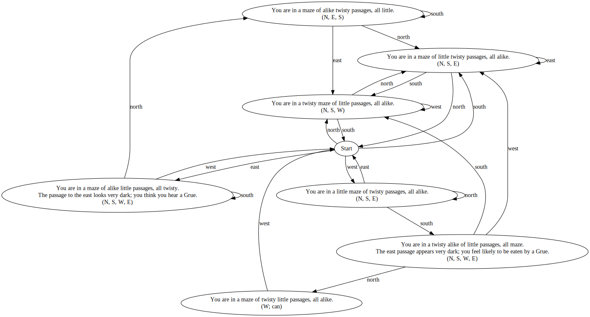

Synacor Challenge
=================

After enjoying the [Intcode](https://adventofcode.com/2019/day/9) puzzles of [Advent of Code 2019](https://adventofcode.com/2019), I decided to delve into the [Synacor Challenge](https://challenge.synacor.com) for some additional fun.

Solution Write-Up (Spoilers)
----------------------------

### First 3 Codes
The first code is included in the [architecture specification](resources/arch-spec). After implementing the virtual machine and running the it with the given binary, the second code is part of the initial outputs. Once all self-tests are passed, the third code is printed out.
```
Welcome to the Synacor Challenge!
Please record your progress by putting codes like
this one into the challenge website: toFCNibybErg

Executing self-test...

self-test complete, all tests pass
The self-test completion code is: QAMZxxmOCPfP
```

### Code No. 4
The challenge binary is a text adventure. Right at the start a tablet lies on the ground. When using the tablet, the fourth code is unveiled.
```
What do you do?
use tablet


You find yourself writing "JmiWLrXEEUlV" on the tablet.  Perhaps it's some kind of code?
```

### Code No. 5
I find an lantern, but without oil it cannot be lit. Without light, the only other possible direction is blocked off by grues. For now, the only accessible area is the "Twisty passages" maze. Here I simply mapped out the maze.



When transitioning to the room where the can of lantern oil is located, the fifth code is found on a wall.
```
Chiseled on the wall of one of the passageways, you see:

    lOEeDprIWMRX

You take note of this and keep walking.

== Twisty passages ==
You are in a maze of twisty little passages, all alike.

Things of interest here:
- can
```

### Code No. 6
With the lantern lit, it is now possible to proceed past the grues into the "Ruins". Here five coins can be found and the equation `_ + _ * _^2 _^3 - _ = 399` has to be solved to unlock a door. Each coin has a specific value, the order in which the coins are inserted determines what value is used for which variable in the equation. The values for the individual coins can be found out by inserting them in arbitrary order and "looking" for the changed values. For me, the coins had the following values:

| Coin          | Value |
| ------------- | ----: |
| red coin      | 2     |
| corroded coin | 3     |
| shiny coin    | 5     |
| concave coin  | 7     |
| blue coin     | 9     |

I solved the equation with a small [Prolog script](resources/coin-puzzle.pl):

```prolog
puzzle(X) :-
    X = [A,B,C,D,E],
    member(2, X),
    member(3, X),
    member(5, X),
    member(7, X),
    member(9, X),
    399 is A + (B * (C^2)) + (D^3) - E.

?- puzzle(X).
X = [9, 2, 5, 7, 3] .
```

Inserting the coins in that order unlocks the door and provides access to a teleporter. Using the teleporter gives me the sixth code.

```
You activate the teleporter!  As you spiral through time and space, you think you see a pattern in the stars...

    DuGWVFxMIYfv

After a few moments, you find yourself back on solid ground and a little disoriented.
```

